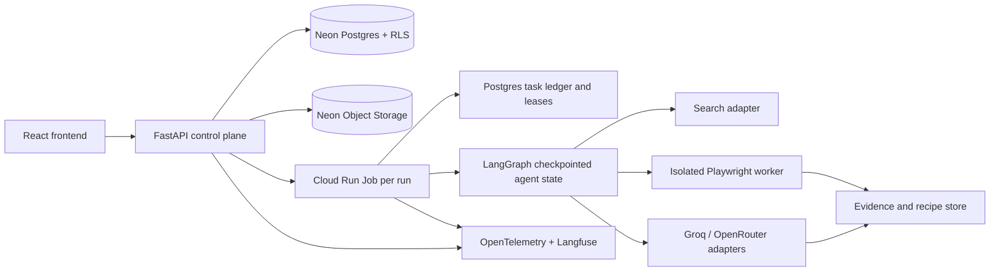

# Daleel backend and AI implementation plan

Status: implementation plan for the private hosted beta, based on PRD v1.4, UI/UX spec v1.1, `FRONTEND_READINESS.md`, and `api/openapi.yaml`. The current frontend is a mock-backed prototype; no backend service is present in this repository.

## Architecture and ownership

FastAPI owns identity mapping, workspace authorization, run creation, plan approval, actions, query APIs, exports, sharing, and deletion. Neon Postgres is the source of truth for plans, runs, typed task DAGs, leases, budgets, findings, evidence metadata, recipes, sessions, and audit events. LangGraph keeps resumable agent state and approval interrupts; the model never controls permissions, budgets, retries, or task claiming. Cloud Run Jobs execute bounded tasks with isolated browser processes. Page text is untrusted input.

## Delivery sequence

### 0. Contract and repository foundation

1. Resolve OpenAPI/frontend drift (session expiry/connection states, export states, invitation delivery, operator grant, gate actions, pagination). Specify error envelopes, idempotency keys, and exact run/recipe identifiers.
2. Generate frontend types/client from OpenAPI. Make mock mode development-only and show a persistent Demo label. Add a backend app package, migrations, container build, environment examples, GitHub Actions, and staging configuration.
3. Define deployment secrets, Cloud Run/Neon regions, budget alerts, retention and deletion ownership. No production credentials in Git.

**Exit:** both sides compile from one contract; CI checks type, lint, tests, API schema, migration, image build, and secret scan.

### 1. Identity, workspace, and core API

1. Integrate Neon Managed Better Auth for invite-only accounts. Validate JWT/session server side. Derive workspace/role from trusted identity, with Postgres Row Level Security and explicit operator access path.
2. Implement `/me`, invitations, settings, usage, and run create/list/get/plan/edit/approve/action/activity with transactional state transitions and idempotency.
3. Persist plans, runs, events, and task DAGs. Implement the Standard default (20 domains, 500 pages, depth 5, 20 minutes, 2 retries/page, 100 MB) plus $0.25 estimated AI spend/run and $5/workspace/month. Reserve before calls, reconcile actual usage, and report non-AI costs separately.

**Exit:** frontend can sign in, create a run, review/approve a persisted plan, refresh, pause/cancel/resume, and see accurate ledger values without mock data. Cross-workspace requests fail closed.

### 2. Safe crawl and evidence pipeline

1. Build a deterministic scheduler: ready-task selection with `SKIP LOCKED`, leases, fencing tokens, idempotent result commits, heartbeat, recovery sweep, bounded retries, and partial-result termination.
2. Add URL canonicalization, frontier deduplication, robots.txt and host pacing, scope/domain/depth/byte/time limits, redirect policy, and SSRF defenses (private address/metadata/protocol/DNS rebinding checks). Use HTTP first and Playwright for dynamic pages when permitted.
3. Persist page status and coverage for every discovered URL. Store minimal evidence with URL, fetch time, excerpt, digest, field linkage, extraction version, and optional snapshot. Keep product data until manual deletion, with 500 MB/workspace and 4 GB beta ceilings.

**Exit:** public crawl respects limits, yields auditable coverage, survives worker restart, and returns partial findings with explicit stop reasons.

### 3. Query-driven agentic extraction

1. Planner produces schema-validated typed tasks and dependency DAG from any query. It proposes candidate domains, extraction fields, relevance criteria, and estimated resource use; deterministic policy code rejects expansions beyond the run envelope. AI Engineer opportunity search is a template, not a fixed schema.
2. Use Plan-and-Execute as the top-level pattern. Add bounded parallel discovery/fetch/extract tasks using ReWOO/LLMCompiler ideas. Use ReAct only for a page-level, read-only interaction fallback. Validation/Reflection checks citations, contradictory fields, completeness, and relevance before publishing; retries are budgeted. Cross-run Reflexion is limited to reviewed feedback and versioned recipes.
3. Prefer deterministic parsing and structured data; call Groq first and OpenRouter Free as a secondary route where policy and budget allow. Validate structured outputs against the plan schema. Ground every factual field in a stored source span; mark unavailable fields Unknown. Enrich relevant listings by visiting their detail pages, then deduplicate listings that refer to one opportunity.
4. Add multilingual extraction, Unicode/RTL handling, language-aware relevance, and a user-visible broad/balanced/strict sensitivity setting (balanced default). No unsupported claim should appear as a confirmed field.

**Exit:** run both the AI Engineer template and an unrelated query end to end; human reviewers can trace every output field to source evidence and see why candidates were included or excluded.

### 4. Authorized browser sessions and reusable RPA

1. Implement hosted interactive login handoff. User completes login, MFA, and any challenge personally. Server validates and encrypts session state; workers receive task-scoped references. Default is no Daleel-imposed expiry, while the target site may expire the session. Provide revoke and reconnect.
2. Build structured, versioned Playwright recipes from successful read-only interactions. Preview and approve a new or changed recipe, replay it on representative pages, validate evidence and extraction, then activate. Record site/task/run/version, detect drift, and propose reviewed revisions. Never include secrets in a recipe.
3. Human gates carry exact task/gate IDs and allowed actions: connect site, review exact recipe version, skip task, or stop. Resolve through a dedicated idempotent API. Autonomous mode may follow public links within its scope and limits but must pause/skip at access, drift, ambiguity, unsafe interaction, or budget boundaries.

**Exit:** an approved recipe succeeds on a later run; drift pauses reuse; an authorized session can be revoked; no challenge bypass or website write occurs.

### 5. Product completion and operations

1. Complete findings, feedback, coverage, exports, explicit workflow saving/versioning, selective sharing, manual deletion of derived artifacts, storage ledger, operator invitations, and audited support access. Operator cannot read raw session secrets or override authenticated-content AI policy.
2. Propagate trace/run IDs through FastAPI, jobs, browser, model, and Postgres events. Use OpenTelemetry and redacted Langfuse traces; emit metrics for queue delay, fetch success, retry rate, extraction accuracy, recipe replay, spend, and partial reasons.
3. Deploy with GitHub Actions and short-lived OIDC to Cloud Run. Use staging migrations and a controlled production promotion. Keep worker concurrency and cloud billing alerts low for the private beta.

**Exit:** run crash/restart, lease expiry, cancellation, provider timeout/quota exhaustion, storage cap, recipe drift, MFA/CAPTCHA barrier, and deletion all produce the expected audited state and preserved partial results. Frontend integration gate in `FRONTEND_VALIDATION_REPORT.md` passes.

## Suggested implementation slices

| Slice | Backend/API | AI/worker | Frontend integration |
|---|---|---|---|
| A | Auth, workspace, settings, migrations | — | Replace mock identity; remove role switch |
| B | Runs/plans/actions/events/task ledger | Planner schema and budgets | Query → plan → approval → activity |
| C | Coverage/findings/evidence | Discovery, fetch, extract, verify | Results, detail, coverage, feedback |
| D | Sessions/recipes/gates | Isolated browser, replay, drift | Hosted login, recipe review, gate resolution |
| E | Workflow/share/export/deletion/admin | Quality evaluation and telemetry | Remaining owner/operator screens |

Keep each slice deployable in staging and close it only after an end-to-end browser run against the live API. The beta is product-ready when the exit criteria above pass on real sites and the UI no longer relies on mock state.
